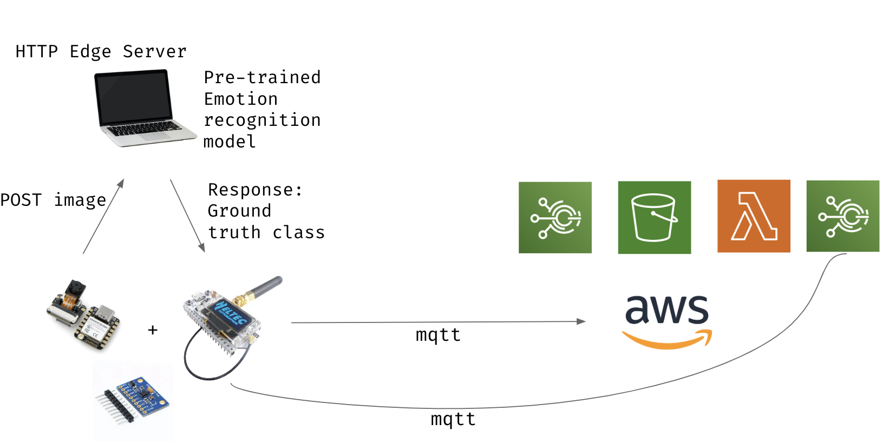

# CARefree
A car dealership test drive monitoring system - Group project for the IoT '23-'24 course, Sapienza University of Rome.

## Members

| **Name and Surname** | **LinkedIn** | **GitHub** |
| :---: | :---: | :---: |
| `Adrian Gheorghiu ` | <a href="https://www.linkedin.com/in/adrian-gheorghiu-52340a141/"></a> | <a href="https://github.com/RaySteak"></a> |
| `Djibril Coulybaly ` | <a href="https://www.linkedin.com/in/djibril-coulybaly/"></a> | <a href="https://github.com/djibril-coulybaly"></a> |
| `Pedro Moreira ` | <a href="https://www.linkedin.com/in/pjfmoreira/"></a> | <a href="https://github.com/MoreiraP12"></a> |


### Table of Contents

1. [About](#about)
2. [Objective](#objective)
3. [Why IoT?](#why-iot)
4. [Features](#features)
   - [Additional Features](#additional-features)
5. [Architecture](#architecture)
   - [Components](#components)
   - [Detailed Process Flow](#detailed-process-flow)
6. [Main Challenges](#challenges)
7. [Measurements](#measurements)
8. [Configurability](#configurability)

## About <a name="about"></a>
Car dealerships salespeople need to join in on the test drive on the passenger side to make sure everything goes smoothly. What if the process could be automated to make sure the driver doesn’t stray from the designated range and conforms to smooth driving with no sudden acceleration, brakes, or jitters? On top of that the dealership can collect information on the facial expressions of the drivers to detect the emotions they are feeling about the car.


### Objective <a name="objective"></a>
🚗 **Automate Test Drives**: Traditional test drives require salespeople to accompany potential buyers, ensuring everything goes smoothly. What if this process could be automated? By leveraging IoT technology, we can ensure that drivers stay within a designated range and drive smoothly, without sudden acceleration, braking, or jitters.

😃 **Capture Driver Emotions**: Collecting information on the facial expressions of drivers allows dealerships to gauge real-time emotions and reactions to the car, providing valuable insights into customer preferences.

🔍 **Real-Time Analysis**: Analyze driver sentiment and driving behavior in real-time to gather comprehensive data, enhancing the dealership's understanding of customer preferences and safety concerns.

### Why IoT?

The Internet of Things (IoT) is an ideal solution for this project due to its ability to seamlessly integrate multiple devices and sensors to collect and analyze data in real-time. Here’s why IoT is a perfect fit:

1. **Data Collection and Analysis**: IoT devices can continuously collect data from various sensors, such as cameras and accelerometers, and process this data locally or in the cloud, providing real-time insights.
2. **Automation and Efficiency**: By automating the monitoring process, IoT reduces the need for human intervention, making the process more efficient and less prone to human error.
3. **Scalability**: IoT systems can be easily scaled to monitor multiple vehicles simultaneously, providing a comprehensive solution for large dealerships.
4. **Enhanced Security and Privacy**: IoT solutions can ensure data security and privacy by processing sensitive information locally or on edge devices before sending aggregated data to the cloud.
5. **Cost-Effectiveness**: IoT devices are small, battery-operated, and **cost-efficient**, making them ideal for deployment in multiple vehicles without significant overhead costs.

In summary, IoT technology provides a robust, scalable, and efficient way to automate test drive monitoring, capture and analyze driver emotions, and gather detailed driving behavior data, ultimately enhancing the dealership's insights into customer preferences and safety.

### Features <a name="features"></a>

🚗 **Automated Test Drive Monitoring**: 
- Eliminate the need for a salesperson during test drives.
- Ensure the driver adheres to designated routes and smooth driving practices.

😃 **Driver Sentiment Analysis**:
- Utilize facial recognition technology to analyze driver emotions.
- Gain real-time insights into the driver's reactions and feelings about the car.

📊 **Comprehensive Driving Behavior Analysis**:
- Monitor and record detailed driving behavior, including acceleration, braking, and turns.

🔒 **Data Privacy and Security**:
- Process images and data locally on the edge device, ensuring that sensitive information does not leave the vehicle.
- Utilize end-to-end encryption for all communications between devices and the cloud.

🌐 **Real-Time Data Synchronization**:
- Use MQTT for fast and reliable data transmission between edge devices and the cloud.
- Ensure real-time updates and synchronization of data across all devices.

🔄 **Scalability and Flexibility**:
- Easily deployable across multiple vehicles in a dealership.
- Scalable architecture to handle a large number of concurrent test drives without any need to change the codebase.

🔧 **Customizable and Extensible**:
- Modular design allows for easy customization and addition of new features.
- Compatible with various sensors and devices for enhanced functionality.

### Additional Features

💡 **Federated Learning**:
- Aggregate data from multiple devices while preserving user privacy.
- Improve model accuracy and performance by sharing knowledge across devices.


### Architecture <a name="architecture"></a>

The architecture of the Car Dealership Test Drive Monitoring System is designed to seamlessly integrate various components and technologies to achieve automated test drive monitoring, driver sentiment analysis, and comprehensive driving behavior analysis. The system leverages IoT principles, utilizing ESP32 microcontrollers, camera modules, accelerometers, and cloud services to create a robust, scalable solution.

#### Components

- **ESP32 Microcontroller**: The core device responsible for capturing data, processing it locally, and communicating with the edge server.
- **Camera Module (OV7670)**: Captures images of the driver for emotion analysis.
- **Accelerometer (ADXL345)**: Monitors vehicle acceleration and driving behavior.
- **Edge Server**: Processes images and data, provides real-time classification for model training. Acts as a teacher for the smaller model.
- **Cloud Server**: Handles data aggregation, global model updates, and provides a user-friendly dashboard for monitoring and analysis.

### Detailed Process Flow

#### 1. Initialization and Sensor Setup

When the car starts moving, the ESP32 initializes the camera module (OV7670) and the accelerometer (ADXL345). The system begins capturing data immediately to ensure comprehensive monitoring from the start of the test drive.

#### 2. Data Capture and Preprocessing

- **Camera Capture**: The camera captures images of the driver's face. The images are processed to convert them from VGA RGB565 to QQVGA grayscale, reducing data size and preparing them for feature extraction.
- **Accelerometer Data**: The accelerometer records acceleration data to monitor driving behavior, detecting sudden movements and irregular driving patterns.

#### 3. Feature Extraction using HoG

The system employs Histogram of Oriented Gradients (HoG) for feature extraction from the grayscale images. HoG is chosen due to its effectiveness in capturing edge information and facial features, which are crucial for emotion analysis.

- **Face Detection**: The ESP32 uses an in-built face detection model to identify the presence of a face in the captured image.
- **HoG Feature Extraction**: For each detected face, HoG features are extracted, resulting in a feature vector representing the image.

```c
void *extract_hog_features(uint8_t *in, int height, int width) {
    const int patch_size = HOG_PATCH_SIZE;
    const int num_bins = HOG_NUM_BINS;
    int delta = 180 / num_bins;
    int num_elements = (height / patch_size) * (width / patch_size) * num_bins;

    void *feature_vec = calloc(1 + num_elements * sizeof(float), 1);
    if (!feature_vec) {
        ESP_LOGE(CAM_TAG, "Failed to allocate %lu bytes of memory for HOG", 1 + num_elements * sizeof(float));
        return NULL;
    }
    float *hog = (float *)((uint8_t *)feature_vec + 1);

    for (int i = 0; i < height; i += patch_size) {
        for (int j = 0; j < width; j += patch_size) {
            int bins_start = ((i / patch_size) * (width / patch_size) + (j / patch_size)) * num_bins;
            for (int bi = 0; bi < patch_size; bi++) {
                for (int bj = 0; bj < patch_size; bj++) {
                    int pos = (i + bi) * width + j + bj;
                    int dx = (j == width - 1 ? in[pos] : in[pos + 1]) - (j == 0 ? in[pos] : in[pos - 1]);
                    int dy = (i == height - 1 ? in[pos] : in[pos + width]) - (i == 0 ? in[pos] : in[pos - width]);

                    float angle = atan2f(dy, dx);
                    angle = angle < 0.f ? angle + M_PI : angle;
                    int grad = (int)roundf(angle / M_PI * 180.f);
                    int mag = (int)roundf(sqrtf(dx * dx + dy * dy));
                    int bin_angle = (grad / delta) * delta;
                    bin_angle = bin_angle == 180 ? bin_angle - delta : bin_angle;
                    int contrib1 = (int)roundf(((bin_angle + delta - grad) / (float)delta) * mag);
                    hog[bins_start + bin_angle / delta] += contrib1;
                    if (bin_angle / delta + 1 < num_bins)
                        hog[bins_start + bin_angle / delta + 1] += mag - contrib1;
                }
            }
            float sqr_norm = 0.f;
            for (int k = 0; k < num_bins; k++)
                sqr_norm += hog[bins_start + k] * hog[bins_start + k];
            for (int k = 0; k < num_bins; k++)
                hog[bins_start + k] /= sqrtf(sqr_norm + 1e-6);
        }
    }
    return feature_vec;
}
```

#### 4. Real-Time Data Processing and Classification

- **Local Processing**: The ESP32 processes the extracted HoG features locally. It uses a lightweight neural network for initial classification, determining the driver's emotional state.
- **RESTful API Communication**: Simultaneously, the processed images are sent to the edge server via a RESTful API. This step is part of the teacher-student model where the edge server acts as the "teacher."

```c
void camera_task(void *arg) {
    while (1) {
        camera_fb_t *fb = esp_camera_fb_get();
        if (fb) {
            // Convert image to grayscale and pool it
            uint8_t *pooled = avg_pool_grayscale((uint8_t *)fb->buf, fb->height, fb->width, POOL_KERNEL_SIZE);
            int height = fb->height / POOL_KERNEL_SIZE;
            int width = fb->width / POOL_KERNEL_SIZE;
            
            // Send image to server for classification
            uint8_t class_label;
            http_response response;
            response.data = (char *)&class_label;
            response.done_sem = NULL;
            response.buf_len = sizeof(class_label);

            esp_http_client_handle_t client = http_post(HTTP_HOST, HTTP_PORT, "/predict", (char *)pooled, height * width, "application/octet-stream", &response, false);
            esp_camera_fb_return(fb);

            if (response.completed_successfully && !response.overflown) {
                uint8_t *resized = resize_bilinear_grayscale(pooled, height, width, FACE_SIZE, FACE_SIZE, NULL);
                free(pooled);

                void *feature_vec = extract_hog_features(resized, FACE_SIZE, FACE_SIZE);
                free(resized);

                *((uint8_t *)feature_vec) = class_label;
                xQueueSend(feats_queue, feature_vec, portMAX_DELAY);
                free(feature_vec);
            }
        }
    }
}
```

#### 5. Teacher-Student Model for Training

- **Teacher Model (Edge Server)**: The edge server uses a pre-trained emotion recognition model (e.g., from Hugging Face) to classify the received images. The edge server sends back the ground truth labels to the ESP32.
- **Student Model (ESP32)**: The ESP32 receives the ground truth labels and uses them to perform local training through stochastic gradient descent (SGD). This approach ensures that the ESP32's model continuously improves its accuracy and performance without needing direct access to the raw data.

```c
void train_task(void *arg) {
    static char feature_vec[1 + FEATS_LEN * sizeof(float)];
    float *feats = (float *)(feature_vec + 1);
    float *grads_first;
    float loss;

    for (int step = 0;; step++) {
        xQueueReceive(feats_queue, feature_vec, portMAX_DELAY);
        uint8_t target = *((uint8_t *)feature_vec);

        xSemaphoreTake(model_lock, portMAX_DELAY);
        if (currently_receiving_model) {
            step = (step / EPOCHS_PER_ROUND) * EPOCHS_PER_ROUND;
            xSemaphoreGive(model_lock);
            continue;
        }

        // Forward pass and loss computation
        linear_forward(feats, w, b, FEATS_LEN, NUM_CLASSES, out);
        loss = cross_entropy_with_logits(out, target);

        // Backpropagation and gradient descent
        float *grads_out = backprop_cross_entropy(out, target);
        for (int i = 0; i < FEATS_LEN; i++) {
            for (int j = 0; j < NUM_CLASSES; j++) {
                w[i * NUM_CLASSES + j] -= LEARNING_RATE * feats[i] * grads_out[j];
            }
        }
        for (int j = 0; j < NUM_CLASSES; j++) {
            b[j] -= LEARNING_RATE * grads_out[j];
        }
        free(grads_out);
        xSemaphoreGive(model_lock);

        if ((step + 1) % EPOCHS_PER_ROUND == 0) {
            esp_mqtt_client_publish(client, mqtt_post_topic, (const char *)model, sizeof(model), MQTT_QOS, 0);
            xSemaphoreTake(weights_received, portMAX_DELAY);
        }
    }
}
```

#### 6. Federated Learning for Model Aggregation

- **Local Model Training**: Each ESP32 device captures driver sentiment data and performs local training. This ensures data privacy as images never leave the device.
- **Weight Aggregation**: Periodically, the ESP32 devices send their trained weights to the cloud server. The cloud server aggregates these weights from multiple devices to create a global model.

### Architecture Diagram


### Main Challenges <a name="challenges"></a>

Developing the Car Dealership Test Drive Monitoring System presented several significant challenges. These challenges required innovative solutions and careful consideration to ensure the system's functionality, efficiency, and reliability.

#### 1. **Limited Memory and Computational Power of ESP32**

**Challenge**: The ESP32 microcontroller has limited memory and computational power, which poses a challenge for implementing complex models and handling large data sets.

**Solution**: 
- **Simplified Feature Extraction**: Instead of using a large pre-trained Convolutional Neural Network (CNN), the system uses Histogram of Oriented Gradients (HoG) for feature extraction. HoG is computationally efficient and requires less memory.
- **Lightweight Neural Network**: The extracted HoG features are processed by a lightweight neural network, reducing the computational burden on the ESP32.

#### 2. **Real-Time Data Processing**

**Challenge**: Ensuring real-time data processing for capturing, processing, and analyzing images and accelerometer data is critical to provide timely insights and feedback during test drives.

**Solution**:
- **Efficient Data Capture**: The system captures images and accelerometer data in real-time and processes them locally on the ESP32. 
- **RESTful API Communication**: Processed images are sent to the edge server via a RESTful API for further classification and feedback.

#### 3. **Data Privacy and Security**

**Challenge**: Handling sensitive data such as images of drivers' faces requires robust privacy and security measures to protect user information.

**Solution**:
- **Local Processing**: All initial data processing, including image capture and feature extraction, is performed locally on the ESP32. This ensures that sensitive data does not leave the device.
- **Encrypted Communication**: Data sent to the edge server and cloud is encrypted using HTTPS and MQTT with TLS, ensuring secure transmission.

#### 4. **Model Training and Updating**

**Challenge**: Continuously training and updating the neural network model on the ESP32 with limited resources, while also incorporating global updates from the cloud server.

**Solution**:
- **Teacher-Student Model**: The edge server acts as a "teacher" to provide ground truth labels for the images sent by the ESP32, which acts as a "student" and performs local training.
- **Federated Learning**: ESP32 devices periodically send their trained weights to the cloud server, which aggregates these weights to create a global model. The global model is then distributed back to the ESP32 devices.


#### 5. **Energy Efficiency**

**Challenge**: Reducing energy consumption to ensure the system can run for extended periods without frequent recharging, especially important for battery-operated IoT devices.

**Solution**:
- **Acceleration Trigger**: Only starts retrieving information when the car is moving.

### Measurements <a name="measurements"></a>

The performance of the Car Dealership Test Drive Monitoring System was evaluated based on several key metrics, including the time required for different processing tasks and the efficiency of data transmission. Below are the detailed measurements obtained during the testing phase:

#### Time to Perform Stochastic Gradient Descent (SGD) Step

The time required to perform one step of Stochastic Gradient Descent (SGD) varies depending on the complexity of the neural network model:

- **2-layer model with 29,207 parameters**: 0.0133 seconds
- **1-layer model with 4,049 parameters**: 0.0024 seconds
- **1-layer model with 567 parameters (dumbed-down HoG)**: 0.0009 seconds

#### HTTP Time to Get Ground Truth

The time taken to send an image to the edge server, process it, and receive the ground truth classification varies based on the image size and quality:

- **80x60 pooled image (4800 bytes)**: 0.21 seconds
- **160x120 original with JPEG quality 50 (1500-2000 bytes)**: 0.16 seconds
- **160x120 original with JPEG quality 50 (1500-2000 bytes)**: 0.14 seconds

#### MQTT Time to Get Aggregate Model

The time taken to receive an aggregate model via MQTT depends on the size of the model being transmitted:

- **2-layer model with 29,207 parameters**: 11.8 seconds
- **1-layer model with 4,049 parameters**: 1.9 seconds
- **1-layer model with 567 parameters (dumbed-down HoG)**: 0.42 seconds

### Summary of Results

- **SGD Step Timing**: The 2-layer model takes significantly longer to process each step of SGD compared to the simpler 1-layer models, highlighting the trade-off between model complexity and processing time.
- **HTTP Ground Truth Retrieval**: Smaller and more compressed images result in faster HTTP response times. The original 160x120 JPEG image provides the quickest response.
- **MQTT Aggregate Model Retrieval**: The time to retrieve the aggregate model decreases with the reduction in model parameters, demonstrating the efficiency gains from using smaller models.

These measurements provide valuable insights into the performance characteristics of the system, helping to identify areas for optimization and ensuring the system meets its real-time processing requirements. By balancing model complexity with processing capabilities, the system can achieve efficient and effective monitoring and analysis during test drives.

### Configurability <a name="configurability"></a>

One of the key strengths of the Car Dealership Test Drive Monitoring System is its high degree of configurability, allowing it to be tailored to various needs and constraints. The project uses numerous macros to define settings and behaviors, making it flexible and adaptable. Below are the main configuration options, illustrated with some key macros from the code.

#### Debug Settings

The debug settings enable or disable various debug features to aid in development and troubleshooting. These settings can be adjusted to control the level of debug information output during system operation.

- **🖼️ Show Image Debug**: Enables or disables the display of captured images for debugging purposes.
- **👤 Show Face Debug**: Enables or disables the display of detected faces within the images for debugging.
- **📉 Print Loss Debug**: Enables or disables the printing of loss values during neural network training, useful for monitoring model performance.
- **🚫 No Block Unreceived Model Debug**: Prevents blocking if the model is not received, which can be useful during testing to avoid deadlocks.

#### Feature Settings

These macros control key features of the system, allowing for customization of the core functionalities based on specific requirements.

- **👀 Use Face Detection**: Enables or disables face detection in the captured images. Disabling this can save computational resources if face detection is not needed.
- **🧠 Two-Layer Neural Network**: Configures the system to use a two-layer neural network for emotion recognition, which can improve accuracy at the cost of increased computational complexity.
- **🔒 HTTPS Communication**: Enables or disables the use of HTTPS for secure communication. Disabling this can simplify setup but reduces security.
- **📡 Asynchronous HTTP Requests**: Enables or disables the use of asynchronous HTTP requests, which can improve efficiency but may complicate error handling.
- **📷 Send JPEG Encoded**: Configures whether to send images as JPEG encoded, which reduces data size at the cost of additional processing.
- **💤 Sleep No Activity**: Enables or disables the sleep mode when there is no activity, which helps in conserving energy.

### Example Configurations

Here are some example configurations demonstrating how these macros can be adjusted to tailor the system to specific needs:

**🔧 Development Configuration**
- All debug options and features are enabled to provide maximum information and functionality during development.

**🏭 Production Configuration**
- Debug options are disabled, but key features such as face detection and HTTPS communication are enabled for a secure and efficient production environment.

### Summary

🔍 **Debugging and Development**: The debug macros provide fine-grained control over the debugging process, making it easy to enable or disable specific debug outputs. This helps in identifying issues and optimizing performance during development.

⚙️ **Feature Toggling**: The feature macros allow toggling critical features like face detection, neural network complexity, and HTTP/HTTPS settings. This flexibility enables the system to be adapted to different environments and requirements without significant code changes.

🔄 **Versatility**: By leveraging these macros, the Car Dealership Test Drive Monitoring System can be easily configured to meet various needs, from intensive development and testing to efficient and secure production deployments.

By providing a high level of configurability, the system ensures that it can be customized and optimized for different use cases, making it a versatile and powerful tool for modern car dealerships.
